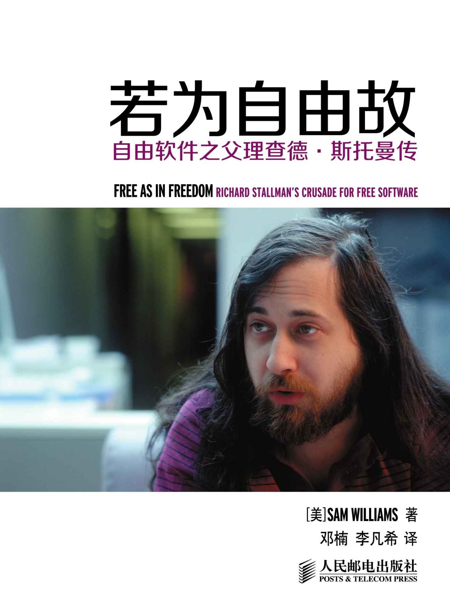

# 若为自由故 Free As in Freedom

* 本书基于[译者的自由代码](https://github.com/lifanxi/free-as-in-freedom-zh-cn)制作,采用现代化方式渲染
* [在线阅读](https://jiayi-pan.gitbook.io/ruo-wei-zi-you-gu-free-as-in-freedom/)
  * 同时收录该书的 PDF, EPUB, MOBI 格式
* [勘误/查看源码](https://github.com/Jiayi-Pan/free-as-in-freedom-RMS-zh-cn)
